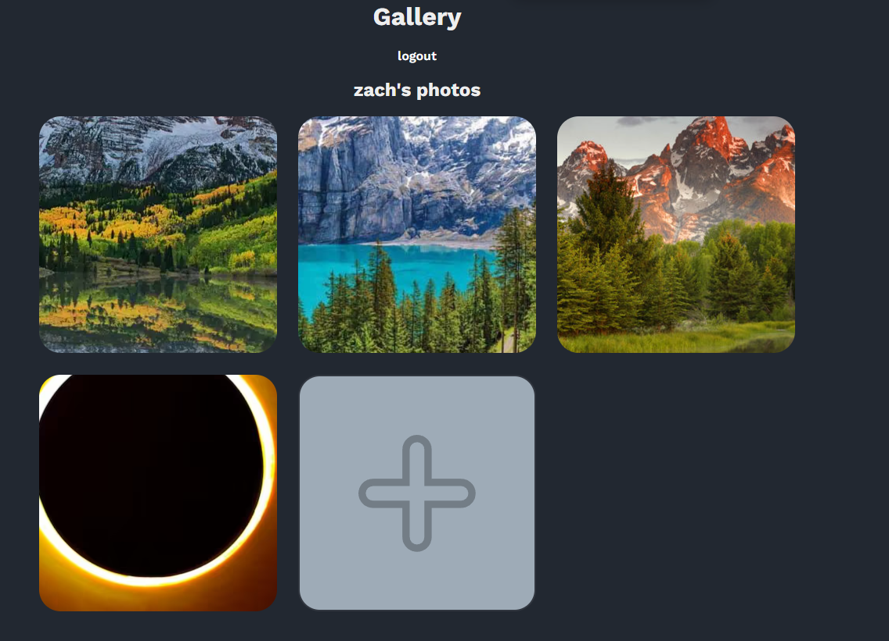

# Full Stack Photo App

This is a full-stack photo gallery app built on the MEAN stack.  
You can sign up or log in, as well as upload, delete, and edit photos!  
This gallery app was built as a single page, with no routing necessary.  
Any image files can be uploaded, png, jpg, webp, etc.  

## Getting Started

### Assumptions:
- you have a Mongo DB cloud instance up and running  
- You have an understanding of Node.js and NPM  

### Steps:

To get started, clone this repository.  
Then run `npm install` in both the back and front end directories.  
Create a .env file in the back end directory and make sure to include a Mongo db URI as DATABASE_URI  
and a secret access token as ACCESS_TOKEN_SECRET.  
Run the server with `node server.js` in the back-end directory.  
Run the front end with `ng serve` in the front-end.  

Voila! Enjoy the photo gallery application.  
